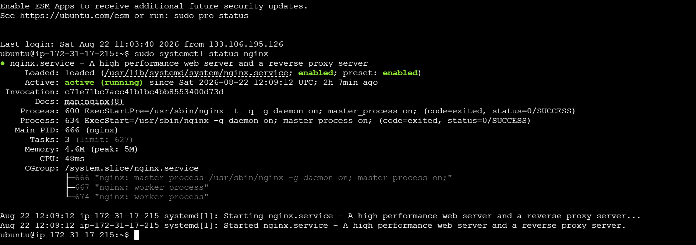
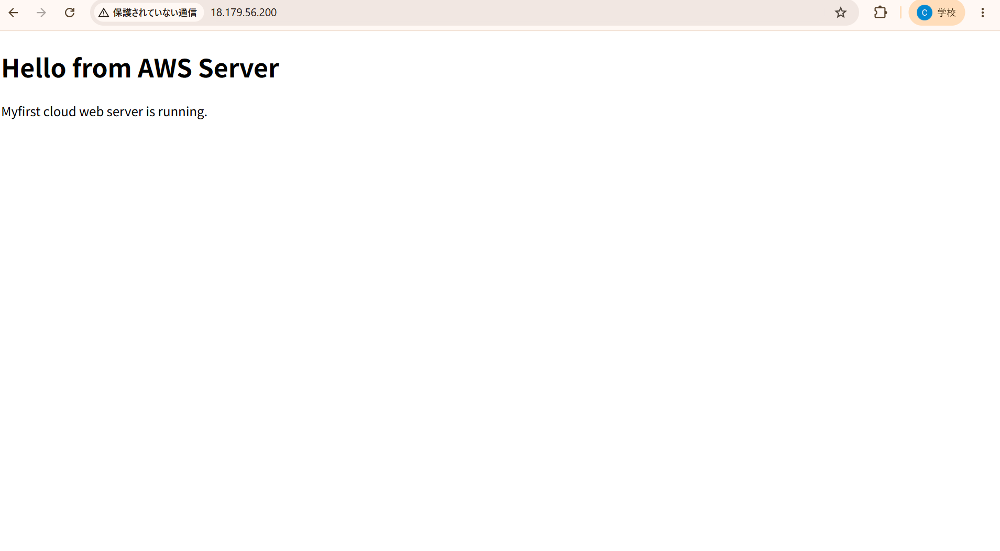
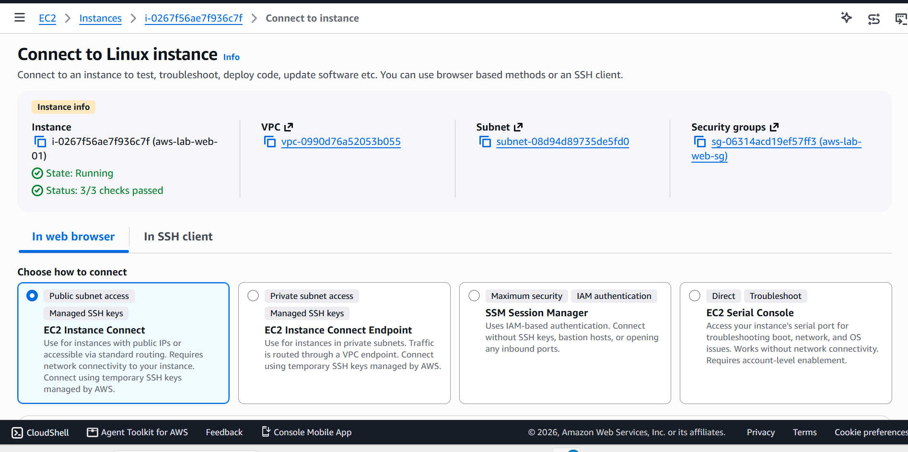

# AWS EC2 Web Server Project

## Project Overview

This project demonstrates how to deploy a public web server on AWS EC2 using Ubuntu Linux and Nginx.

The EC2 instance was configured with secure SSH access, HTTP access, and a custom HTML webpage.

## Architecture

```text
Internet
   |
   | HTTP :80
   v
Security Group
   |
   v
EC2 Instance
Ubuntu Linux
   |
   v
Nginx Web Server
   |
   v
index.html
```

## AWS Services Used

* Amazon EC2
* Amazon VPC
* Security Groups
* Amazon EBS
* Public IPv4
* AWS IAM

## Technologies Used

* Ubuntu Linux
* Nginx
* HTML
* SSH
* AWS CLI
* VS Code

## EC2 Configuration

* Region: Asia Pacific (Tokyo)
* Instance Type: t3.micro
* Operating System: Ubuntu Linux
* Storage: 8 GiB EBS
* Public IP: Auto-assigned

## Security Group Rules

| Type | Port | Source     | Purpose                      |
| ---- | ---: | ---------- | ---------------------------- |
| SSH  |   22 | My IP only | Secure server administration |
| HTTP |   80 | 0.0.0.0/0  | Public website access        |

## Deployment Process

1. Created an EC2 instance in the Tokyo Region.
2. Created an SSH key pair.
3. Configured Security Group rules.
4. Connected to the EC2 instance using SSH.
5. Updated Ubuntu packages.
6. Installed Nginx.
7. Created a custom `index.html`.
8. Accessed the website using the EC2 Public IPv4 address.
9. Used AWS CLI to inspect and manage the EC2 instance.

## Linux Commands Used

```bash
sudo apt update
sudo apt install nginx -y
sudo systemctl status nginx

cd /var/www/html
ls
sudo nano index.html

curl http://localhost
```

## AWS CLI Commands Used

Check EC2 instances:

```bash
aws ec2 describe-instances
```

Stop an EC2 instance:

```bash
aws ec2 stop-instances --instance-ids <INSTANCE_ID> --region ap-northeast-1
```

Start an EC2 instance:

```bash
aws ec2 start-instances --instance-ids <INSTANCE_ID> --region ap-northeast-1
```

Reboot an EC2 instance:

```bash
aws ec2 reboot-instances --instance-ids <INSTANCE_ID> --region ap-northeast-1
```

## EC2 Lifecycle Experiment

### Reboot

* Instance remains running.
* Public IPv4 address remains the same.
* Data remains available.

### Stop and Start

* The instance shuts down and starts again.
* EBS data remains available.
* The auto-assigned Public IPv4 address can change.

## What I Learned

* How to launch and configure an EC2 instance.
* How SSH authentication works with a key pair.
* How Security Groups control inbound traffic.
* Difference between Public IP and Private IP.
* How to install and manage Nginx on Ubuntu.
* How to deploy a basic public website.
* How to inspect and manage EC2 using AWS CLI.
* Difference between EC2 Reboot and Stop/Start.
* Why static addressing such as Elastic IP can be useful.

## Security Practices

* SSH access is restricted to my IP address.
* The private `.pem` key is never stored in this repository.
* AWS credentials and secrets are not committed to Git.
* Root AWS credentials are not used for daily operations.

## Sceenshots

## EC2 Instance Running





